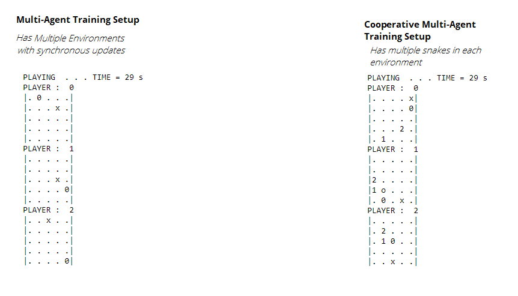

# Running snake game without Gym Environment
To run snake game without gym environment, you can look into folder [multiagent-cooperative env](https://github.com/crazymuse/snakegame-numpy/blob/master/multiagent-cooperative-env/SnakeExample.ipynb). Open jupyter notebook from same and run the sample code.



### Prerequisities
* Install [OpenAI Gym](https://github.com/openai/gym) and [Baselines](https://github.com/openai/baselines)
* Install IPython and numpy via pip or conda.

# How to locally register SnakeNp as custom Gym environment

To add the environment, do  

`cd gym-np-snake`  
`pip install -e .`
  

The gym environment is only supporting single agent setup. However the Snake Trainer and SnakeEnv as listed in parent directory is designed to work for MultiAgent Cooperative setup.

To use the snakegame as gym-environment, use the bellow code sample  : 
```
import gym;
import gym_np_snake;
env = gym.make('SnakeNp-v0')
from time import sleep
reward=0;

while reward>-0.5:    
    ob,reward,dones,info = env.step(0)
    env.render(mode='human')
    sleep(0.1)
```
## Game Description for gym-environment
Reward is between -1 and 1. -1 for collision and 1 for eating the food.   
Observation is 10x10x1 image output of encoded display. Mapping is as follows 

| **pixel description** | **pixel value** |
|-----------------------|-----------------|
| empty space           | 5               |
| snake head west       | 100             |
| snake head north      | 120             |
| snake head east       | 140             |
| snake head south      | 160             |
| snake tail            | 200             |
| food                  | 255             |  
  
Info contains the state information such 4 element tuple with following values (direction/4, normalized x distance, normalized y distance, distance of head from food divided by length+width)
Interpretation of direction for the game is  as follow : 

| **direction** | **value** |
|---------------|-----------|
| west          |    0      |
| north         |    1      |
| east          |    2      |
| south         |    3      |


The actions are Discrete(3) , which means, either a snake can go left, go straight or go right. This is as follow :

| **action**    | **value** |
|---------------|-----------|
| no change     |    0      |
| turn left     |    1      |
| turn right    |    2      |  
